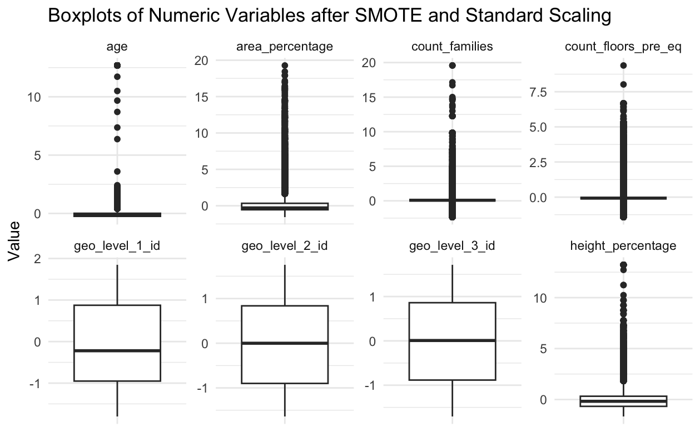
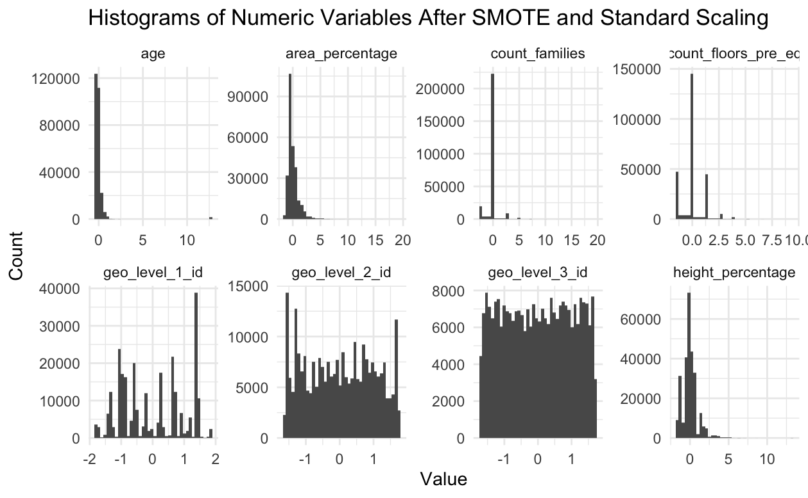
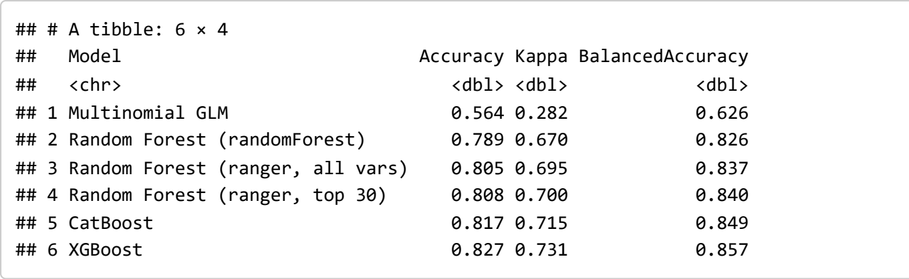
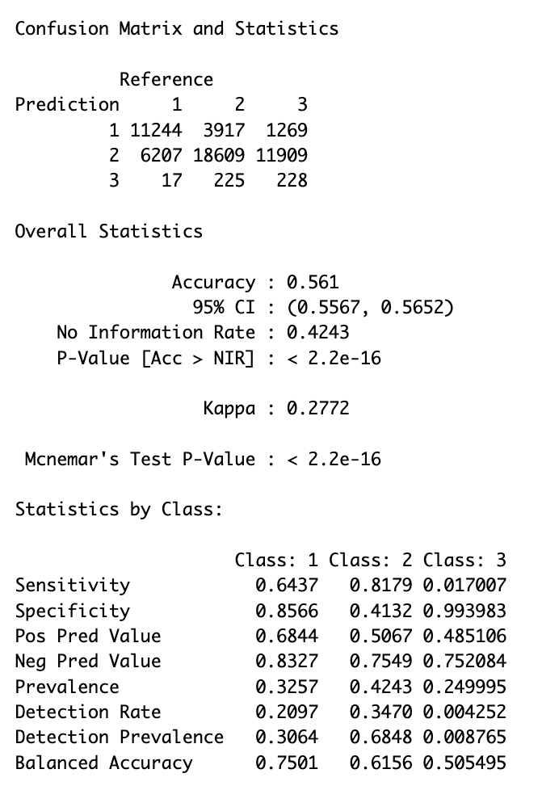
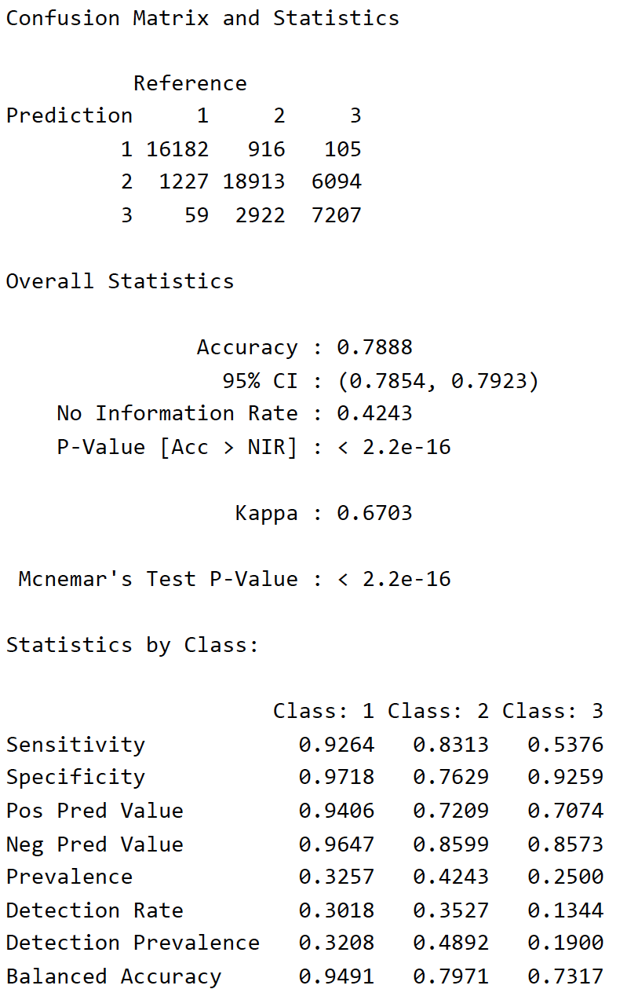
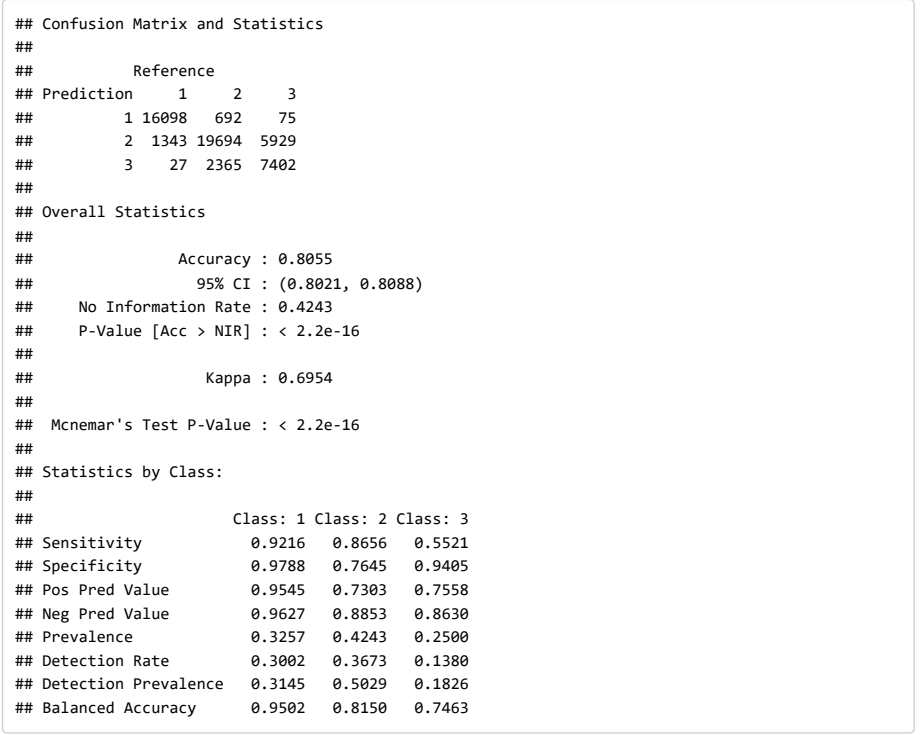
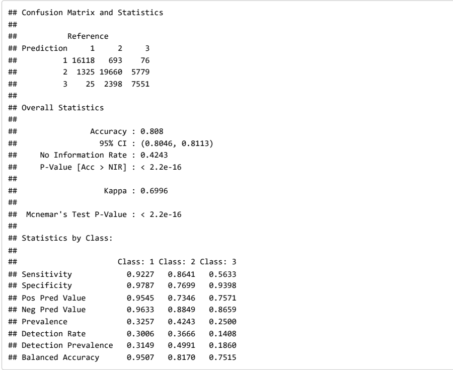
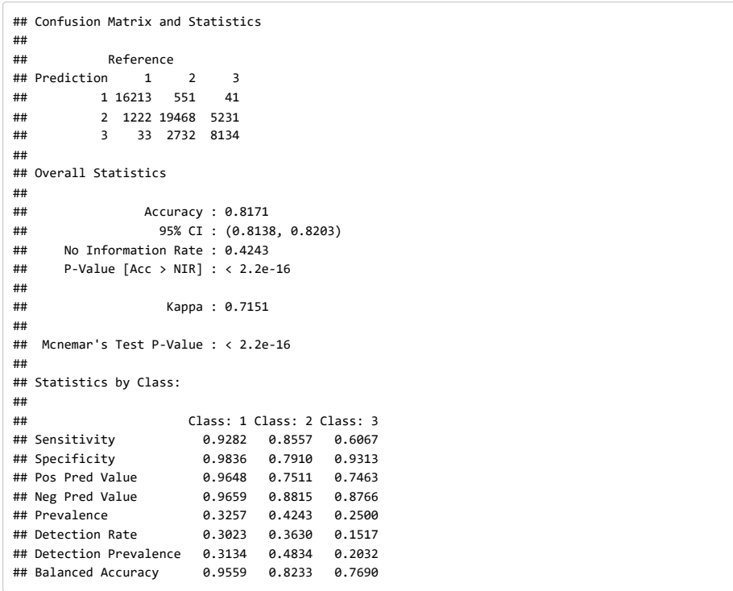
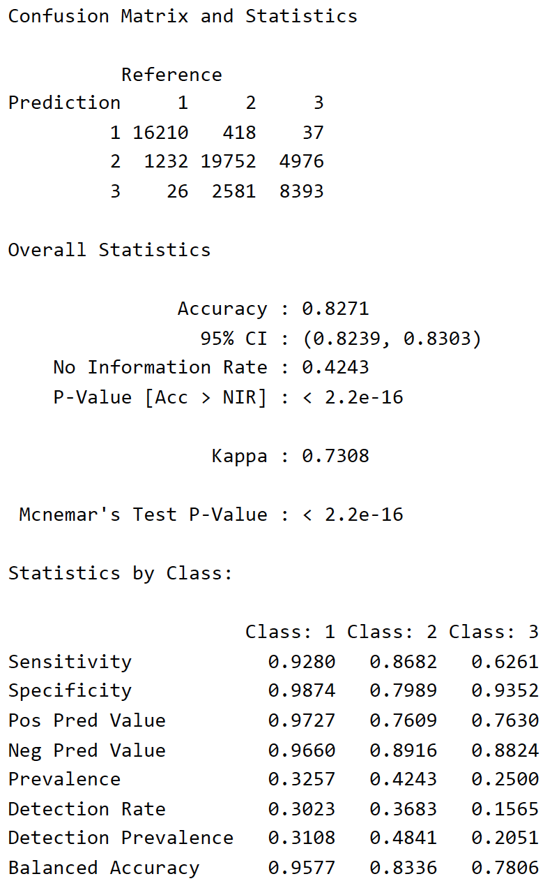

Authors: Tianle Chen, Sicheng Zhang, Zixuan Lin

## Introduction

The April 2015 Nepal earthquake killed almost 9,000 people and was one of the worst natural disasters to strike Nepal in a century, causing widespread destruction of buildings and mass homelessness. Today’s data represent one of the largest post-disaster datasets ever collected, being made available by Kathmandu Living Labs and the Central Bureau of Statistics.

The goal of the project is to predict damage_grade, an ordinal variable which corresponds to the level of damage sustained by each building in the earthquake. 1 represents “low” damage, 2 represents moderate damage, and 3 represents severe damage. Accurate predictions would allow government departments to prioritize inspections and allocate limited reconstruction resources more efficiently in the future circumstances However, inspecting thousands of buildings after an earthquake is both time-consuming and costly, so to make this easier, we use machine learning models that take building and geologic features as inputs and predict the damage grade for each building.

There are numerous varables included in the dataset, below are comprehensive lists of the features and their distributions:

-   Numeric Variables:: geo_level_1_id, geo_level_2_id, geo_level_3_id, count_floors_pre_eq, age, area_percentage, height_percentage, count_families.

-   Numeric Plots:

    {width="319"}{width="326"}

-   Categorical Variables: land_surface_condition, foundation_type, roof_type, other_floor_type, plan_configuration, has_superstructure_mud_mortar_stone, has_superstructure_stone_flag, has_superstructure_mud_mortar_brick, has_superstructure_cement_mortar_brick, has_superstructure_timber, has_superstructure_bamboo, has_superstructure_rc_non_engineered, has_superstructure_rc_engineered, has_superstructure_other, legal_ownership_status, has_secondary_use, has_secondary_use_agriculture, has_secondary_use_hotel, has_secondary_use_rental, has_secondary_use_institution, has_secondary_use_school, has_secondary_use_industry, has_secondary_use_health_post, has_secondary_use_gov_office, has_secondary_use_use_police, has_secondary_use_other.

-   Categorical Plots:

    {width="327"}{width="334"}

    {width="329"}

## Data Cleaning & Feature Engineering

Before proceeding to modeling, it is important for us to keep track of missing values as well as response variable imbalancing issue.

We checked the number of missing values for every column in the data-set and realized that there are no missing values at all, allowing us to proceed to imbalancing detection of response variable (damage_grade).

We checked the current proportions of sample belonging to the three damage grades and observed that there are 9.6% of samples belonging to damage_grade = 1, 56.88% of samples belonging to damage_grade = 2, and 33.52% of samples belonging to damage_grade = 3.

While proportions of samples belonging to damage_grade = 2, 3 are not concerning, there are far less samples in damage_grade = 1 and thus our models might over-fit features from samples in damage_grade = 2 or 3. In order to mitigate such issue, we utilized SMOTE to raise the proportion of samples belong to damage_grade = 1 by making fake identities with possible features of real samples with damage_grade = 1. After SMOTE, the proportions of samples belonging to each damage grade is - "damage_grade = 1" : 32.57%, "damage_grade = 2" : 42.43%, "damage_grade = 3" : 25%.

Finally, to avoid potential modeling bias from large scaled numerical variables, we used standard scaling to keep all numerical variables between 0 and 1. After scaling, the numeral variables have following distributions:

{width="339"} {width="333"}

## Methodology

We tried multiple models to predict the damage_grade of buildings, including generalized linear model with multinomial link function, Random Forest, Categorical Boosting, and XGBoost.

For generalized linear model, we used the multinomial link function to account for the ordinal nature of the response variable. We also selected features based on their distributions to avoid invariant features (e.g. features with merely any level variations, visually identified through histograms). With feature interpretations in mind as well, we selected the following features for the GLM model: age, area_percentage, height_percentage, count_floors_pre_eq, geo_level_1_id, geo_level_2_id, geo_level_3_id, land_surface_condition, roof_type, other_floor_type, and has_superstructure_mud_mortar_stone. All features are directly related to the physical characteristics of the buildings, which are expected to have significant impact on the damage level.

For Random Forest, Categorical Boosting, and XGBoost models, we used all features in the dataset after doing our data cleaning and feature engineering to maximize the predictive power of the models, as all models are based on average performance of n decision trees with different features selected. Though we lose interpretability of the features in these models, we are able to achieve higher accuracy in prediction.

For Random Forest, we first fit a basic model using the randomForest package. Then, we tried a faster ranger implementation to get variable-importance measures and to train larger forests more efficiently. To examine whether we should keep using all the features or just the top-important ones for our tree-based models, we printed out the importance scores from ranger, and implemented a “top-30 features” version that only keeps the 30 most important predictors, to examine whether a smaller number of engineered features could perform better or not. In the ranger model, we set the number of trees to 600 as well as standard settings such as mtry ≈ sqrt(p) and a slightly larger leaf size to help limit overfitting and accelerate implementation speed.

For CatBoost, which is a gradient-boosting model, is used and found useful to deal with categorical predictors. After label encoding the predictors, we fit and trained a multiclass CatBoost model to predict the damage grades. We tuned a few key settings such as tree depth, learning rate, and number of iterations. To evaluate how well this model performed, we looked at overall accuracy, balanced accuracy, and ROC curves for each damage grade class.

For XGBoost, we did a small greedy hyperparameter search rather than using the default settings. On the SMOTE-balanced training data, we searched over a grid of tree depths (max_depth) and learning rate (eta) and checked how each combination performed on a held-out test split. We picked the pair that gives the highest balanced accuracy, and using that best tree depth and learning rate, we fit our XGBoost model with subsample = 0.8 and colsample_bytree = 0.8.

As an additional check, we also created a new version code and experimented with an Isolation Forest algorithm on the numeric predictors to flag extreme outliers. Specifically, Isolation Forest builds many random trees and gives each observation an anomaly score based on how quickly it can be isolated in these trees. We treated the top 2% observations, which have the highest anomaly score, as potential outliers and removed them to create a filtered version of the dataset. We then approached the same workflow and refit the same models on this new dataset to check whether a small number of extreme buildings has a significant impact on our results.

## Results

We evaluated all models on the 20% held-out test set from the SMOTE-balanced and scaled data. The table below summarizes overall accuracy, Cohen's Kappa, and balanced accuracy for each model.

{width="500"} 

We are first showing results of the multinomial link GLM (Figure 2). It has an accuracy of 56.1%, which is only 6% higher than random guessing. It also has a Kappa of 0.28 and balanced accuracy around 62.6%. The confusion matrix shows that the GLM model tends to predict the "damage_grade = 2" class too often but struggles to correctly identify the other two classes. The reason GLM is not performing well in here is that the GLM mostly assumes straight-line effects and no rich interactions between variables, so it can't pick up the complex patterns in the building-damage data.

Next, we are showing results from the baseline random forest model (Figure 3). It has a better overall accurarcy score than GLM. It achieves test accuracy around 78.9%, Kappa around 0.67, and balanced accuracy around 82.6%. Sensitivity for damage_grade = 1 and damage_grade = 3 improves substantially compared with the GLM, although there is still some confusion between damage_grades 2 and 3.

{width="199"}
*Figure 2. Multinomial Link GLM.*
{width="190"}
*Figure 3. Baseline Random Forest.*

The ranger implementation (Figure 4) improves things a bit further. With all predictors included, ranger reaches accuracy around 80.5% and balanced accuracy around 83.7%. When we restrict ranger to the top 30 most important predictors (Figure 5), performance is almost unchanged with accuracy around 80.8%, balanced accuracy around 84.0%, and a slightly higher Kappa around 0.70). This implies that only a small group of key variables is doing almost all the work, so once those are in the model, adding all the other predictors doesn't really help the accuracy any further.

{width="300"} 
{width="300"}

This result (Figure 6) shows that CatBoost outperforms the Random Forest models, with accuracy about 81.7%, Kappa around 0.72, and balanced accuracy around 84.9%. Actually, CatBoost handles the many categorical variables very well and can produce more even performance across the three damage_grade classes. The ROC curves also showed reasonably high AUCs for all three damage grades, which means the model did a good job classifying buildings by damage grade.

Lastly, we are showing the results from the greedy-tuned XGBoost model (Figure 7). It has the best accuracy score among all models. The confusion matrix show very high sensitivity and specificity for damage_grade = 1 and damage_grade = 2, with a relatively lower but fairly reasonable sensitivity for damage_grade = 3. Also, ROC curves for XGBoost also show strong separation between damage_grade classes. Therefore, we used it to generate damage_grade predictions for all building ID in nepal_test, which we submit as our final set of test predictions.

{width="300"} 
{width="196"}

In total, our greedy-tuned XGBoost and CatBoost models outperforms the random forest models because boosting builds trees sequentially, where each tree is built focusing and correcting on the errors of the previous trees, instead of just averaging many independent bagged trees like in random forest. This usually allows us to identify more complex patterns in the data. In our case, XGBoost performed better than CatBoost, which is a little bit surprising because CatBoost is a newer gradient boosting algorithm that is usually very strong on data with many categorical variables. The reason is practically-driven instead of theoretical that we spent more efforts tuning XGBoost's key hyperparameters, such as tree depth and learning rate, using greedy search, so it can adapt more closely to the patterns in the training data. However, our CatBoost model was run with mostly default settings and only light tuning, and thus did not reach the same level of accuracy as XGBoost. So this experience shows the importance of careful hyperparameter tuning and model comparison, and we should not assume that a more recent, advanced or fancy algorithm will automatically perform better.

## Discussions

Below is the comparison table between all the models that we tested:

{width="458"}

The greedy-tuned XGBoost model performance evaluated using overall accuracy on the held-out test data is 82.8%, and the balanced accuracy is 85.8%, which are both high and extremely satisfactory. The ROC curves of this model also shows excellent class separability, and we can see that AUC for damage grade 1 is 0.993, 0.908 for grade 2, and 0.912 grade 3, with a macro-AUC of 0.937.

We also observed some misclassifications, and the model mostly confuses between closeby classes. However, the minor misclassification is acceptable especially considering the complexity of real-world situations and likelihood of overfitting. In conclusion, the fitted model discriminates very well overall, as we can see from the sensitivity, specificity, etc. of every classes, showing that the model have the great potential to be practically used for real-world damagegrade prediction.

Also, it would be worthy to point out that we also tried some other methods including but not limiting to GLM, Random Forest, CatBoost, etc. The basic random forest method also yield to a very strong accuracy of around 80%, and so for interpretability purposes one could also use random forest to draw geological conclusions.

{width="421"}

After refitting all models after removing the potential outliers by Isolation Forest, the main performance metrics changed only slightly. The XGBoost model still had the best accuracy and balanced accuracy, and the relative ranking of models stayed the same. This suggests that our conclusions are not being mastered by a handful of extreme buildings/outliers, and that the original results based on the full SMOTE-balanced dataset are fairly robust.

