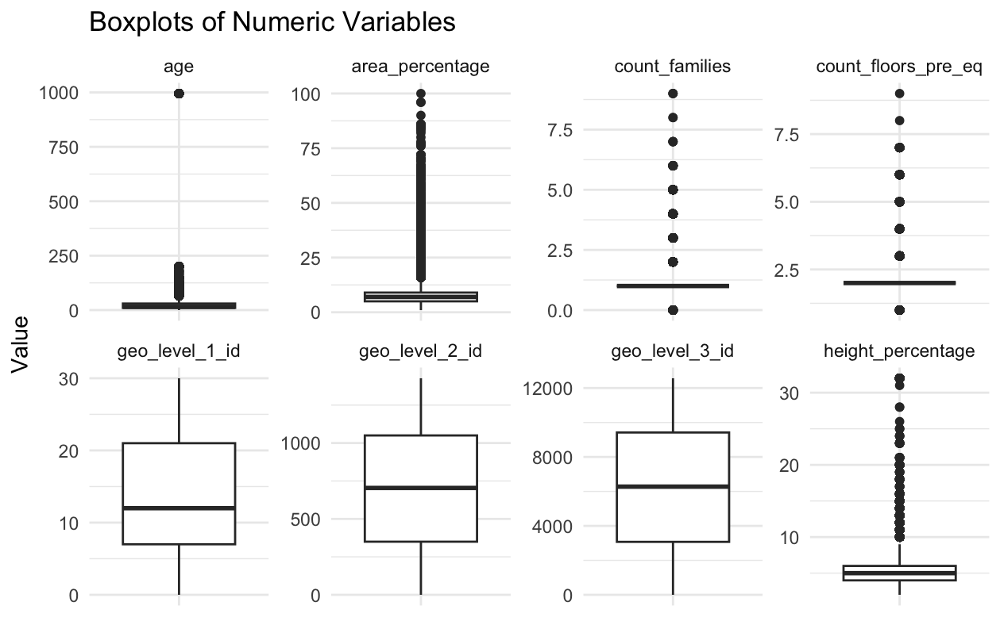
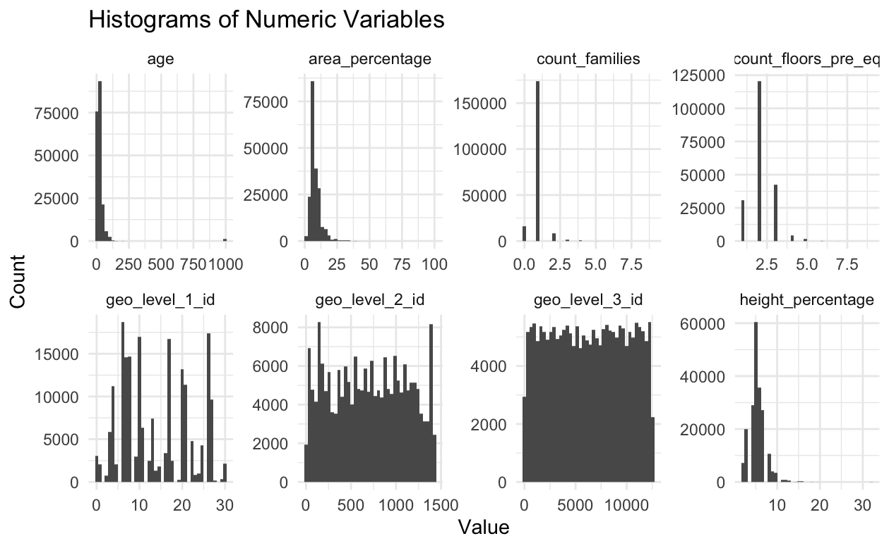
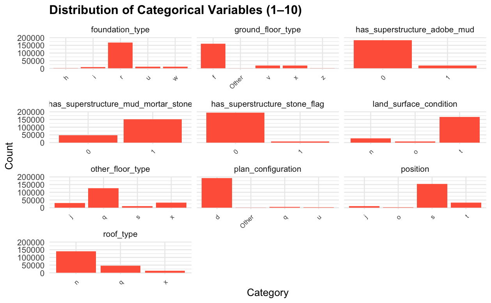
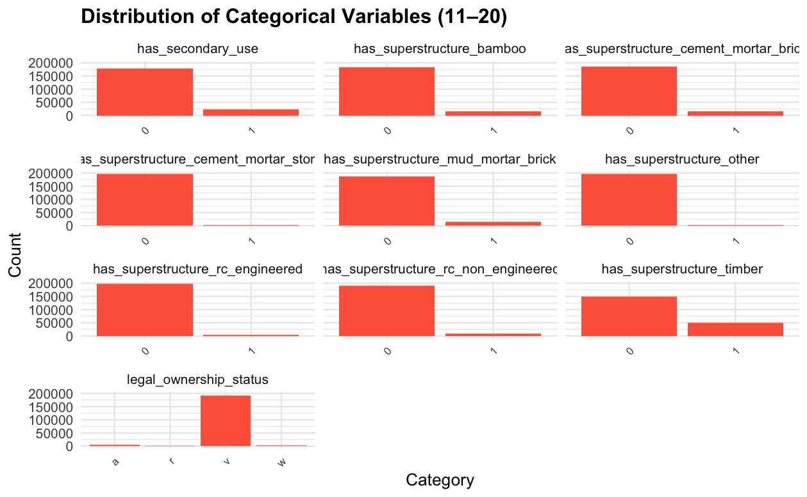
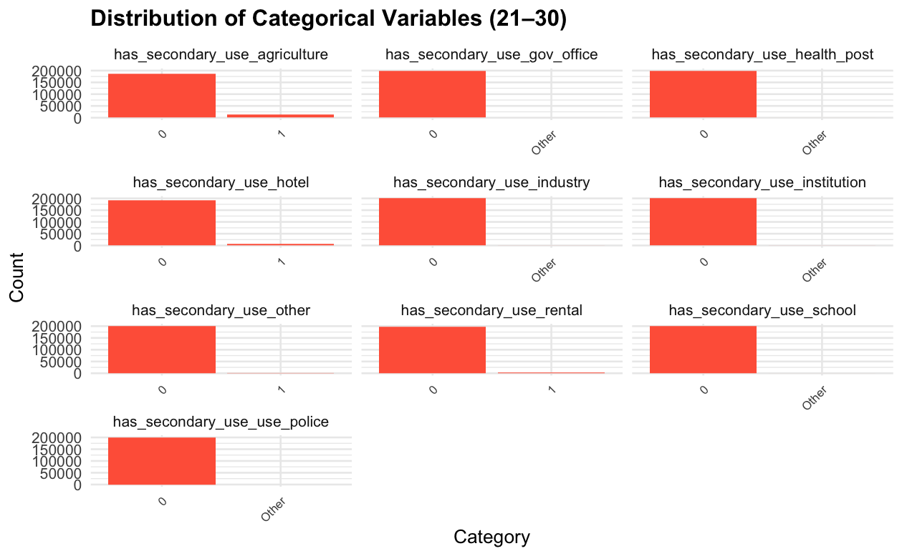

Authors: Tianle Chen, Sicheng Zhang, Zixuan Lin

## Introduction

The April 2015 Nepal earthquake caused nearly 9,000 deaths and massive building damage, resulting in one of the largest post-disaster datasets ever collected. This project aims to predict **damage_grade**, an ordinal measure of building destruction (1 = low, 2 = moderate, 3 = severe). Accurate predictions help officials prioritize inspections and allocate reconstruction resources efficiently. Because large-scale manual inspections are costly and slow, we use machine-learning models that take building and geological features as inputs to automatically estimate damage severity.

There are numerous varables included in the dataset, below are the features distributions:

-   Numeric Plots:

    {width="216"}{width="208"}

-   Categorical Plots:

    {width="236"}{width="222"}{width="219"}

## Data Cleaning & Feature Engineering

Before modeling, we checked data quality and class balance. There were no missing values, so we focused on the imbalance in damage_grade, where only 9.6% of buildings were labeled as grade 1. Because this could cause the models to overfit grades 2 and 3, we used SMOTE to oversample grade 1. After SMOTE, the class distribution became more balanced (about 32.6% / 42.4% / 25% for grades 1–3). We then applied standard scaling to numerical variables to keep them on comparable ranges and reduce bias from differing scales.

## Methodology

We evaluated several models to predict damage_grade, including a multinomial generalized linear model (GLM), Random Forest, CatBoost, and XGBoost.

For the multinomial GLM, we selected predictors based on variation and interpretability, removing invariant or near-constant features. The final set included variables reflecting structural and geographic characteristics (e.g., age, area_percentage, height_percentage, floor count, geo-levels, land_surface_condition, roof_type, and others). These features directly describe building attributes that plausibly affect damage severity.

For tree-based models (Random Forest, CatBoost, XGBoost), we used the full engineered feature set to maximize predictive power. Although these models sacrifice interpretability, they typically achieve higher accuracy because they aggregate information across many decision trees. Within Random Forest, we first fit a baseline model using the randomForest package, then used the faster ranger implementation to extract variable importance and to train larger forests efficiently. We also built a “top-30 features” version to test whether limiting the model to the most important predictors improved performance.

CatBoost, designed to handle categorical variables well, was trained using label-encoded predictors and tuned for tree depth, learning rate, and number of iterations.

For XGBoost, we conducted a small greedy hyperparameter search over max_depth and learning rate on SMOTE-balanced data and checked how each combination performed on a held-out test split, selecting the pairs that maximized balanced accuracy. Using that best tree depth and learning rate, we fit our XGBoost model with subsample = 0.8 and colsample_bytree = 0.8 to avoid overfitting. 

As a robustness check, we also experimented with an Isolation Forest on numeric predictors to flag extreme outliers. Removing the top 2% most anomalous observations, we refit the full set of models to assess how sensitive results were to extreme cases.

## Results

We evaluated all models on the 20% held-out test set from the SMOTE-balanced and scaled data. The table below summarizes overall accuracy, Cohen's Kappa, and balanced accuracy for each model.

```{r}
#| echo: false

library(kableExtra)

results_tbl <- tibble::tribble(
  ~Model, ~Accuracy, ~Kappa, ~BalancedAccuracy,
  "Multinomial GLM",                0.564, 0.282, 0.626,
  "Random Forest (randomForest)",   0.789, 0.670, 0.826,
  "Random Forest (ranger, all vars)", 0.805, 0.695, 0.837,
  "Random Forest (ranger, top 30)",   0.808, 0.700, 0.840,
  "CatBoost",                       0.817, 0.715, 0.849,
  "XGBoost",                        0.827, 0.731, 0.857
)

results_tbl |>
  kbl(caption = "Table 1: Model Performance Summary") |>
  kable_styling(full_width = FALSE)
```

We are first showing results of the multinomial link GLM. It has an accuracy of 56.1%, which is only 6% higher than random guessing. It also has a Kappa of 0.28 and balanced accuracy around 62.6%. The confusion matrix shows that the GLM model tends to predict the “damage_grade = 2” class too often but struggles to correctly identify the other two classes. The reason GLM is not performing well in here is that the GLM mostly assumes straight-line effects and no rich interactions between variables, so it can’t pick up the complex patterns in the building-damage data.

The baseline Random Forest (Table 3) performs much better, reaching ≈78.9% accuracy, Kappa ≈ 0.67, and balanced accuracy ≈ 82.6%. It substantially improves sensitivity for classes 1 and 3 compared with the GLM, though some confusion between damage_grades 2 and 3 remains.

```{r}
#| echo: false
#| message: false
#| warning: false

library(kableExtra)
library(dplyr)

one_table <- tribble(
  ~Accuracy, ~Kappa,
  0.561,     0.2772
) |>
  mutate(
    `Sensitivity(1)` = 0.6437,
    `Sensitivity(2)` = 0.8179,
    `Sensitivity(3)` = 0.0170,
    `Specificity(1)` = 0.8566,
    `Specificity(2)` = 0.4132,
    `Specificity(3)` = 0.9940
  )

one_table |>
  kbl(caption = "Table 2: GLM Stats (1,2,3 refers to damage grade)") |>
  kable_styling(full_width = FALSE)
```

```{r}
#| echo: false
#| message: false
#| warning: false

library(kableExtra)
library(dplyr)

one_table_rf <- tribble(
  ~Accuracy, ~Kappa,
  0.7888,    0.6703
) |>
  mutate(
    `Sensitivity(1)` = 0.9264,
    `Sensitivity(2)` = 0.8313,
    `Sensitivity(3)` = 0.5376,
    `Specificity(1)` = 0.9718,
    `Specificity(2)` = 0.7629,
    `Specificity(3)` = 0.9259
  )

one_table_rf |>
  kbl(caption = "Table 3: Random Forest Stats (1,2,3 refers to damage grade)") |>
  kable_styling(full_width = FALSE)
```

The ranger implementation (Table 4) improves things a bit further. With all predictors included, ranger reaches accuracy around 80.5% and balanced accuracy around 83.7%. When we restrict ranger to the top 30 most important predictors (Table 5), performance is almost unchanged with accuracy around 80.8%, balanced accuracy around 84.0%, and a slightly higher Kappa around 0.70). This implies that only a small group of key variables is doing almost all the work, so once those are in the model, adding all the other predictors doesn't really help the accuracy any further.

```{r}
#| echo: false
#| message: false
#| warning: false

library(kableExtra)
library(dplyr)

one_table_rf2 <- tribble(
  ~Accuracy, ~Kappa,
  0.8055,    0.6954
) |>
  mutate(
    `Sensitivity(1)` = 0.9216,
    `Sensitivity(2)` = 0.8656,
    `Sensitivity(3)` = 0.5521,
    `Specificity(1)` = 0.9788,
    `Specificity(2)` = 0.7645,
    `Specificity(3)` = 0.9405
  )

one_table_rf2 |>
  kbl(caption = "Table 4: Fast Implementation of Random Forests Stats with all predictors (1,2,3 refer to damage grade)") |>
  kable_styling(full_width = FALSE)
```

```{r}
#| echo: false
#| message: false
#| warning: false

library(kableExtra)
library(dplyr)

one_table_model <- tribble(
  ~Accuracy, ~Kappa,
  0.808,     0.6996
) |>
  mutate(
    `Sensitivity(1)` = 0.9227,
    `Sensitivity(2)` = 0.8641,
    `Sensitivity(3)` = 0.5633,
    `Specificity(1)` = 0.9787,
    `Specificity(2)` = 0.7699,
    `Specificity(3)` = 0.9398
  )

one_table_model |>
  kbl(caption = "Table 5: Fast Implementation of Random Forests Stats with top 30 predictors (1,2,3 refer to damage grade)") |>
  kable_styling(full_width = FALSE)
```

CatBoost (Table 6) outperforms the Random Forest models, achieving ≈81.7% accuracy, Kappa ≈ 0.72, and balanced accuracy ≈ 84.9%. Actually, CatBoost handles the many categorical variables very well and can produce more even performance across the three damage_grade classes. The ROC curves show high AUC values for each class, indicating strong classification ability.

The greedy-tuned XGBoost model (Table 7) performs best overall, which has the best accuracy score among all models. The confusion matrix show very high sensitivity and specificity for damage_grade = 1 and 2, with a relatively lower but fairly reasonable sensitivity for damage_grade = 3. Also, ROC curves for XGBoost also show strong separation between damage_grade classes. Therefore, we used it to generate damage_grade predictions for all building ID in nepal_test.

```{r}
#| echo: false
#| message: false
#| warning: false

library(kableExtra)
library(dplyr)

one_table_model4 <- tribble(
  ~Accuracy, ~Kappa,
  0.8171,    0.7151
) |>
  mutate(
    `Sensitivity(1)` = 0.9282,
    `Sensitivity(2)` = 0.8557,
    `Sensitivity(3)` = 0.6067,
    `Specificity(1)` = 0.9836,
    `Specificity(2)` = 0.7910,
    `Specificity(3)` = 0.9313
  )

one_table_model4 |>
  kbl(caption = "Table 6: Categorical Boosting Stats (1,2,3 refer to damage grade)") |>
  kable_styling(full_width = FALSE)
```

```{r}
#| echo: false
#| message: false
#| warning: false

library(kableExtra)
library(dplyr)

one_table_model5 <- tribble(
  ~Accuracy, ~Kappa,
  0.8271,    0.7308
) |>
  mutate(
    `Sensitivity(1)` = 0.9280,
    `Sensitivity(2)` = 0.8682,
    `Sensitivity(3)` = 0.6261,
    `Specificity(1)` = 0.9874,
    `Specificity(2)` = 0.7989,
    `Specificity(3)` = 0.9352
  )

one_table_model5 |>
  kbl(caption = "Table 7: Greedy Tuned XGBoost Stats (1,2,3 refer to damage grade)") |>
  kable_styling(full_width = FALSE)
```

In total, our greedy-tuned XGBoost and CatBoost models outperforms the random forest models because boosting builds trees sequentially, where each tree is built focusing and correcting on the errors of the previous trees, instead of just averaging many independent bagged trees like in random forest. This usually allows us to identify more complex patterns in the data. In our case, XGBoost performed better than CatBoost, which is a little bit surprising because CatBoost is a newer gradient boosting algorithm that is usually very strong on data with many categorical variables. The reason is practically-driven instead of theoretical that we spent more efforts tuning XGBoost's key hyperparameters, such as tree depth and learning rate, using greedy search, so it can adapt more closely to the patterns in the training data. However, our CatBoost model was run with mostly default settings and only light tuning, and thus did not reach the same level of accuracy as XGBoost. So this experience shows the importance of careful hyperparameter tuning and model comparison, and we should not assume that a more recent, advanced or fancy algorithm will automatically perform better.

## Discussions

The greedy-tuned XGBoost model performance evaluated using overall accuracy on the held-out test data is 82.8%, and the balanced accuracy is 85.8%, which are both high and extremely satisfactory. The ROC curves of this model also shows excellent class separability, and we can see that AUC for damage grade 1 is 0.993, 0.908 for grade 2, and 0.912 grade 3, with a macro-AUC of 0.937.

We also observed some misclassifications, and the model mostly confuses between closeby classes. However, the minor misclassification is acceptable especially considering the complexity of real-world situations and likelihood of overfitting. In conclusion, the fitted model discriminates very well overall, as we can see from the sensitivity, specificity, etc. of every classes, showing that the model have the great potential to be practically used for real-world damagegrade prediction.

Also, it would be worthy to point out that we also tried some other methods including but not limiting to GLM, Random Forest, CatBoost, etc. The basic random forest method also yield to a very strong accuracy of around 80%, and so for interpretability purposes one could also use random forest to draw geological conclusions.

{width="314"}

After refitting all models after removing the potential outliers by Isolation Forest, the main performance metrics changed only slightly. The XGBoost model still had the best accuracy and balanced accuracy, and the relative ranking of models stayed the same. This suggests that our conclusions are not being mastered by a handful of extreme buildings/outliers, and that the original results based on the full SMOTE-balanced dataset are fairly robust.
